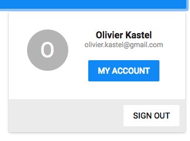

# AppBarMyAccount [Repo](https://github.com/React-Quiver/AppBarMyAccount)

AppBarMyAccount written with React.

## Getting started
```
npm install
npm start
```

## Description
My account popup.




## Documentation
Check the complete documentation and working example in React-Quiver doc website.
